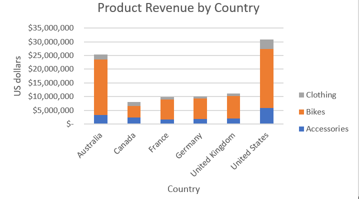
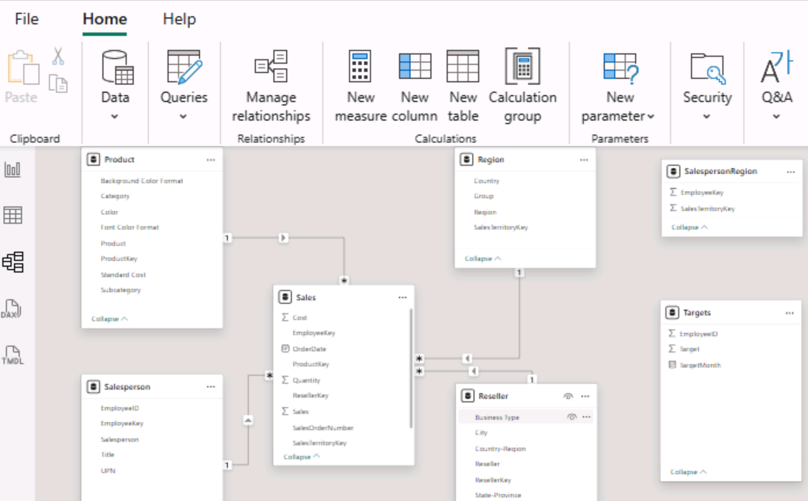
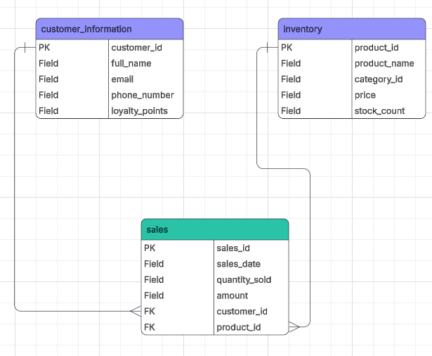

# Bootcamp-workbooks
# 🚀 Data Analytics Portfolio: 6-Week Intensive
This repository documents my journey through an intensive data analytics program, completing six distinct projects that bridge the gap between raw data and actionable insights.
---
# 📊 Week 1 Analysis Projects  
## Data Cleaning, Visualisation, and Excel Pivot Tables

This project introduces core **Data Technician and Data Analyst skills** using **Microsoft Excel**, including data governance research, exploratory data analysis, pivot tables, and business-focused visualisations.

The goal was to transform **raw datasets into clear insights that support business decision-making**.

---

# 1️⃣ Data Governance & Compliance Research

Understanding the **legal and ethical responsibilities of handling customer data** is essential for data professionals.

## UK Regulations Analysed
- Data Protection Act 2018  
- General Data Protection Regulation (GDPR)  
- Freedom of Information Act 2000  
- Computer Misuse Act 1990  

## Key Learning Points

- Organisations must collect **only necessary personal data**.  
- Individuals have the right to **access, correct, or delete their data**.  
- Businesses must implement **strong security controls** to protect information.  
- Data breaches can lead to **large financial penalties and reputational damage**.

This research highlighted the importance of **ethical data handling and regulatory compliance** in data-driven organisations.

---

# 2️⃣ Retail Sales Data Analysis (Excel)

A **retail sales dataset** was analysed to practice fundamental **Excel data analysis techniques**.

## Tasks Completed

- Converted raw data into a **structured Excel table**
- Sorted **customer age data (largest → smallest)**
- Calculated **total commission using `SUM()`**
- Calculated **average commission using `AVERAGE()`**

## Skills Demonstrated

- Data organisation  
- Basic aggregation  
- Excel formula usage  
- Preparing datasets for analysis  

These steps helped transform **raw data into structured, analysable information**.

---

# 3️⃣ Pivot Table Analysis – Bike Sales Dataset

Pivot tables were used to analyse **bike sales profitability by product, country, age group, and gender**.

## Example Pivot Analysis

| Country | Key Observation |
|--------|----------------|
| United States | Highest overall profit |
| Australia | Strong bike sales performance |
| UK & Canada | Lowest profit levels |

## Product Insights

- **Mountain-200 Black** and **Mountain-200 Silver** were the most popular bike models.
- The **Mountain-100 series had limited male customer purchases**.

## Customer Demographics

- **Adults aged 35–64 generated the majority of revenue**
- **Young adults (25–34)** were the second largest customer group
- **Under 25 customers generated the lowest sales**

These insights highlight opportunities for **targeted marketing strategies**.

---

# 📈 Data Visualisation Dashboard

The dataset was visualised using charts to clearly communicate **business insights**.



## Chart Highlights

### Product Revenue by Country (Stacked Column Chart)

Key insights from the visualisation:

- **Bikes generate the highest revenue across all countries**
- **United States and Australia dominate overall product sales**
- **Canada shows significantly lower sales compared to other regions**
- **Accessories contribute modest revenue compared to bikes**
- **Clothing represents the smallest product category**

This visualisation helps identify **high-performing markets and product categories**.

---

# 📉 Cost Efficiency Analysis

A **cost-to-revenue ratio** was used to measure operational efficiency.

## Formula Used

```
Cost-to-Revenue Ratio = (Total Costs / Revenue) × 100
```

## Findings

- Operational efficiency peaked in **2019**
- Costs increased slightly during **2020–2021**
- Further analysis is required to identify cost drivers such as:

  - Marketing expenses  
  - Production costs  
  - Supply chain operations  

---

# 💡 Business Recommendations

Based on the analysis:

- 🎯 Increase marketing targeting **younger customers (<25)**
- 🚲 Focus on high-performing products such as **Mountain-200 bikes**
- 🌍 Improve sales strategies in **Canada and the UK**
- 📊 Investigate **rising operational costs after 2019**

These strategies could help **increase revenue and improve operational efficiency**.

---
# 📚 Learning Outcomes

This project demonstrates the ability to:

- Understand **data governance and compliance**
- Perform **structured data analysis**
- Use **Excel pivot tables for data exploration**
- Create **clear business visualisations**
- Translate analytical findings into **actionable business recommendations**

# 📊 Week 2 – Data Technician Workbook

## Overview

This workbook documents practical exercises completed during **Week 2 of the Data Technician training programme**.  
The activities focus on developing foundational skills in **data handling, Excel analysis, pivot tables, and data visualisation**.

The purpose of this workbook is to demonstrate the ability to **work with structured datasets, perform analysis, and communicate insights clearly**.

---

# 📚 Workbook Contents

The workbook contains multiple structured tasks designed to build key **data analysis and business intelligence skills**.

## 1️⃣ Data Governance and Legal Compliance

This section explores the **legal responsibilities involved in working with customer data**.

### Topics Covered

- Data Protection Act 2018  
- General Data Protection Regulation (GDPR)  
- Freedom of Information Act 2000  
- Computer Misuse Act 1990  

### Key Learning Outcomes

- Understanding **data privacy and ethical data handling**
- Identifying **legal obligations when processing personal data**
- Recognising potential **risks and penalties for data breaches**
- Applying best practices for **secure data management**

---

## 2️⃣ Excel Data Analysis Tasks

This section focuses on practical **Excel data analysis techniques** using sample datasets.

### Activities Completed

- Converting raw datasets into **Excel tables**
- Sorting data fields for analysis
- Performing calculations using **Excel formulas**

### Functions Used

- `SUM()` – to calculate total values  
- `AVERAGE()` – to calculate mean values  
- Sorting and filtering tools  

### Skills Developed

- Data cleaning and preparation  
- Basic statistical analysis  
- Spreadsheet organisation  

---

## 3️⃣ Pivot Table Data Exploration

A dataset was analysed using **Excel Pivot Tables** to summarise sales data and identify patterns.

### Analysis Dimensions

- Product type  
- Country / market  
- Customer age groups  
- Gender  

### Insights Generated

- Identification of **top-performing markets**
- Analysis of **customer demographic trends**
- Evaluation of **product profitability**

Pivot tables enabled quick transformation of raw data into **meaningful summaries for decision-making**.

---

## 4️⃣ Data Categorisation Using Excel Functions

The workbook demonstrates how to classify data using the **SWITCH function**.

### Example Logic

```
=SWITCH(TRUE,
C2 > 600, "High",
C2 >= 300, "Medium",
"Low")
```

### Purpose

- Categorise sales performance levels
- Simplify analysis of large datasets
- Improve readability of analytical outputs

---

## 5️⃣ Data Visualisation

Charts were created to communicate findings visually.

### Visualisation Techniques Used

- Column charts
- Line charts
- Pie charts

### Objectives

- Present key insights clearly
- Highlight trends and comparisons
- Support business decision-making

---

# 🛠 Tools Used

- **Microsoft Excel**
- Pivot Tables
- Excel formulas and functions
- Data visualisation charts

---
---

# 🎯 Learning Outcomes

Through this workbook, the following skills were developed:

- Data governance awareness
- Data cleaning and preparation
- Spreadsheet analysis techniques
- Pivot table data exploration
- Visual communication of insights
- Translating analysis into **business recommendations**

---

⭐ This project demonstrates the ability to work with **realistic business datasets and communicate analytical findings effectively**.
## 🛠 Tech Stack
| Category | Tools & Languages |
| :--- | :--- |
| **Data Processing** | Python, SQL, Excel |
| **Visualization** | Tableau, Power BI |
| **Cloud Computing** | Microsoft Azure |

## 📈 Technical Competencies
Throughout these projects, I developed a robust workflow for handling data lifecycles:

* **Data Cleaning & Preprocessing:** Handling null values, data type conversion, and "dirty" data strings using Python (Pandas) and SQL.
* **Aggregation & Summarization:** Leveraging SQL `GROUP BY` statements and Excel Pivot Tables to distill high-level metrics.
* **Exploratory Data Analysis (EDA):** Utilizing Python and Tableau to identify distributions, outliers, and correlations.
* **Insight Generation:** Creating interactive dashboards in Power BI and Tableau to communicate complex findings to stakeholders.

---

## 📂 Project Highlights

* **Excel:** Financial modeling and interactive dashboarding.
* **Tableau:** Geospatial analysis and storytelling.
* **Python:** Automated data cleaning and statistical analysis.
* **Azure:** Cloud-based data storage and management.
# 📊 Adventure Works Sales Dashboard

---

## 📈 Sales & Profit Margin Overview

**Period:** July 2019 – June 2020  
**Data Refresh:** 5 minutes ago  


---

## 💰 Sales Summary

### Sales YTD (FY2020)
# **$33,139,748**

---

## 📌 Metrics Explained

- 🔵 **Sales** — Monthly revenue in USD
- 📉 **Profit Margin** — Monthly profit margin percentage
- 📆 Fiscal Year 2020 reporting

---

## 🗂 Project Structure


* **Data Cleaning & Preprocessing:** Handling null values, data type conversion, and "dirty" data strings using Python (Pandas) and SQL.
* **Aggregation & Summarization:** Leveraging SQL `GROUP BY` statements and Excel Pivot Tables to distill high-level metrics.
* **Exploratory Data Analysis (EDA):** Utilizing Python and Tableau to identify distributions, outliers, and correlations.
* **Insight Generation:** Creating interactive dashboards in Power BI and Tableau to communicate complex findings to stakeholders.

---
---
# Week 5 – Data Technician Workbook

This repository contains notes, resources, and practical outputs from **Week 5** of the Data Technician course.  
The focus is on **cloud computing, alternative infrastructure, and Microsoft Azure data services**, with practical exercises demonstrating cloud-based data solutions.

---

## 📂 Repository Contents

- **5Data_Technician_Workbook_Week_5.docx**  
  Workbook covering cloud fundamentals, infrastructure alternatives, provider comparisons, and Azure labs.

- **image/week5PBirelnimage.png**  
  Screenshot highlighting **Power BI dashboard outputs and Azure lab results**.

---

## ☁️ Cloud Computing Overview

Cloud infrastructure enables organizations to run global systems and process transactions across multiple regions simultaneously.

**Key Benefits**

- **Cost Efficiency** – Pay-as-you-go reduces upfront hardware costs  
- **Scalability** – Resources scale dynamically with demand  
- **Accessibility** – Systems accessible from anywhere via the internet  
- **Disaster Recovery** – Automated backups and redundancy protect data  

---

## 🏗 Alternative Infrastructure Options

When cloud platforms are not used, organisations may rely on:

- **On-Premise Infrastructure** – Locally managed servers and hardware  
- **Edge Computing** – Processing data near the source for faster insights  
- **Fog Computing** – Decentralised processing within local networks  
- **Local Storage** – NAS devices, USB storage, or local backups  
- **Virtualisation** – Simulated environments similar to cloud infrastructure  

---

## ☁️ Cloud Provider Comparison

| Feature | AWS | Azure | GCP |
|------|------|------|------|
| Global Infrastructure | 31+ regions, 99 zones | Large global region coverage | High-performance global network |
| Resource Provisioning | Rapid deployment of compute & storage | Pay-as-you-go services | Integrated analytics & AI tools |
| Security | AWS Nitro & compliance certifications | Azure Confidential Computing | Zero-trust architecture |
| Scalability | Automatic scaling | Auto-scale cloud services | Global autoscaling |
| Flexibility | Multi-OS and hybrid support | Strong Microsoft ecosystem integration | Distributed cloud computing |

---

## 🟦 Azure Data Fundamentals (DP-900)

This week explored how **Microsoft Azure services support real-world data solutions**, including:

- Cloud service models (**IaaS, PaaS, SaaS**)  
- Cloud deployment types (**public, private, hybrid**)  
- Data governance and compliance  
- Azure data services architecture  
- Business solution design using Azure tools  

---

## ⚖️ Data Protection & Compliance

Key regulations discussed:

- **GDPR**
- **Data Protection Act 2018**
- **Computer Misuse Act**
- **PCI DSS**

These frameworks guide **secure data management and legal compliance in cloud environments**.

---

## 🧪 Azure Practical Labs

Hands-on activities included:

- Exploring **relational and non-relational data**
- Querying cloud data services
- Using **Azure analytics tools**
- Visualising insights with **Power BI**

---

## 🐾 Business Case Scenario – *Paws & Whiskers*

Designed a cloud data solution for a retail company using Azure services:

- **Azure Blob Storage** – scalable storage for large datasets  
- **Azure SQL Database** – structured transactional data  
- **Azure Machine Learning** – predictive analytics  
- **Azure Data Factory** – automated data pipelines  
- **Power BI** – business intelligence dashboards  

Additional considerations:

- Data modelling
- Security and encryption
- Backup and disaster recovery
- Scalability planning

---

## 🛠 Skills Developed

- Cloud computing fundamentals  
- Azure data service selection  
- Data architecture design  
- Data governance and compliance awareness  
- Translating business requirements into technical cloud solutions  

---

## 📊 Practical Output

Power BI dashboard and Azure lab results demonstrating:

- Integration of **Azure Blob Storage**, **SQL Database**, and **Power BI**
- Data-driven insights into business performance
- Practical cloud-based data processing



---

## 🔎 Reflection

This week strengthened understanding of **scalable cloud data architectures**, **Azure services**, and **secure data management**, reinforcing how cloud platforms support modern **data-driven business operations**.
# 🗄 Week 3 – Database Concepts & SQL

## 🎯 Overview
Week 3 focused on understanding **database structure and relational data analysis using SQL**.  
The work combined **database theory, relational modelling, and practical SQL querying** to analyse structured datasets.

Key areas covered:

- Primary & Foreign Keys
- Database relationships
- Relational vs Non-Relational databases
- SQL JOIN operations
- Practical SQL querying using a **world database**

---

# 🧠 Database Fundamentals

This section explored the core concepts that underpin relational databases.

### Key Concepts

**Primary Keys**
- Uniquely identify each record within a table
- Prevent duplicate entries
- Provide the basis for table relationships

**Foreign Keys**
- Link related tables together
- Reference a primary key from another table
- Enable relational database structures

### Relationship Types Studied

- **One-to-One** – one record relates to exactly one record
- **One-to-Many** – one record relates to multiple records
- **Many-to-Many** – records in both tables relate to multiple records

These concepts ensure data remains **structured, organised, and reliable** across database systems.

---

# 🗂 Relational Database Model

The following Entity Relationship Diagram illustrates a simple **sales database structure**.

---
## 📊 Week 3 Highlight: Database Structure ERD



This Entity Relationship Diagram (ERD) illustrates the core database structure used in Week 3, depicting the relationships between the **customer_information**, **inventory**, and **sales** tables.  
It highlights how primary and foreign keys link tables, enabling complex queries and efficient data management in relational databases.

### 📊 Database Structure Highlights

The database is organised into **three relational tables**:

| Table | Purpose |
|------|--------|
| **customer_information** | Stores customer identity and contact details |
| **inventory** | Stores product information and stock levels |
| **sales** | Records sales transactions linking customers and products |

---

### 🔑 Table Key Structure

**Customer Table**

Primary Key:

customer_id


Fields include:

- full_name
- email
- phone_number
- loyalty_points

This table stores **customer profile information** used to track purchases and loyalty rewards.

---

**Inventory Table**

Primary Key:

product_id


Fields include:

- product_name
- category_id
- price
- stock_count

This table manages **product catalog information and inventory levels**.

---

**Sales Table**

Primary Key:

sales_id


Foreign Keys:


customer_id → customer_information
product_id → inventory


Fields include:

- sales_date
- quantity_sold
- amount

The **sales table acts as the central transactional table**, linking customers to purchased products.

---

### 🔗 Relationship Highlights

The ERD demonstrates two key **one-to-many relationships**:

| Relationship | Description |
|---|---|
| Customer → Sales | One customer can have multiple purchases |
| Product → Sales | One product can appear in many sales records |

This design enables analysts to answer questions such as:

- Which customers generate the most revenue?
- Which products sell the most?
- How does inventory affect sales performance?

---

# 🔄 SQL JOIN Types

Week 3 also focused on understanding how **multiple tables can be combined using SQL JOIN operations**.

JOIN types studied:

- **INNER JOIN** – returns matching records from both tables
- **LEFT JOIN** – returns all records from the left table
- **RIGHT JOIN** – returns all records from the right table
- **FULL JOIN** – returns all records from both tables
- **CROSS JOIN** – returns all possible combinations
- **SELF JOIN** – joins a table with itself

Understanding these joins enables analysts to **combine related datasets and extract meaningful insights**.

---

# 🗃 SQL Practical – World Database

Practical SQL exercises were completed using a **sample world database**.

### Queries Performed

- Counting cities in the **USA**
- Identifying countries with the **highest and lowest life expectancy**
- Filtering cities by **name patterns**
- Sorting and limiting query results
- Calculating **average population by country**
- Comparing **capital city populations**

These exercises strengthened **real-world SQL querying and analytical skills**.

---

# 📸 SQL Query Output

Example query outputs were generated during the analysis to validate results and demonstrate SQL functionality.

*Example outputs include filtered datasets, aggregated calculations, and ranked results.*

---

# 🛠 Skills Demonstrated

- Relational Database Design
- Entity Relationship Diagrams (ERD)
- SQL Query Writing
- SQL JOIN Operations
- Data Analysis using relational databases
- Data modelling and schema design

---

# 💻 Example SQL Queries Used in Week 3

```sql
-- Count number of cities in the USA
SELECT COUNT(*) AS city_count
FROM city
WHERE countrycode = 'USA';

-- Find countries with highest and lowest life expectancy
SELECT Name, LifeExpectancy
FROM country
ORDER BY LifeExpectancy DESC
LIMIT 5;

-- Filter cities starting with 'San'
SELECT Name, CountryCode, Population
FROM city
WHERE Name LIKE 'San%'
ORDER BY Population DESC;

-- Calculate average population by country
SELECT countrycode, AVG(population) AS avg_population
FROM city
GROUP BY countrycode
ORDER BY avg_population DESC;

-- Compare population of capital cities
SELECT country.Name AS Country, city.Name AS CapitalCity, city.Population
FROM country
JOIN city ON country.Capital = city.ID
ORDER BY city.Population DESC;
